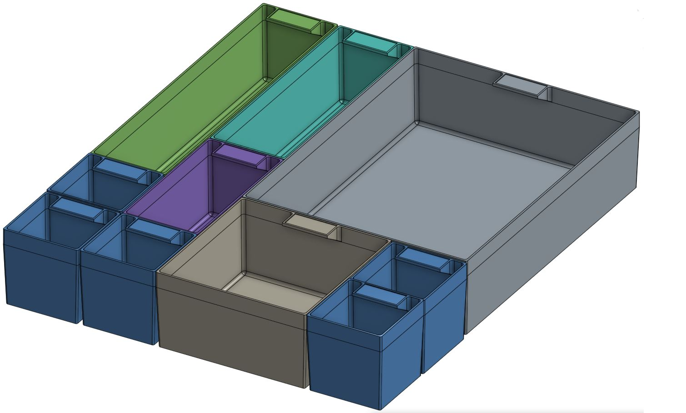

# Project P.U.R.S.E
### Programmable Unattended Retrieval and Storage Experience

### If you are here after visiting with me at Maker Faire Orlando - welcome! 

*Please be gentle, this repo is very rough while proper documentation is being created and the project is coming together. Feel free to reach out with any 
questions if needed. I can be reached at **michael@michaelgrundvig.com*** and ***913-203-5167***

---

**[StorageController](StorageController)**: This is the application that provides the brains of the system. It handles the JSON database, 
barcode processing, etc. It also provides all the REST endpoints for the UI. **There is a web-based UI in this project that can be used for now. It will likely be replaced with something much nicer later**

**[StepperServer](StepperServer)**: This is an Arduino project to control the stepper motors. The StorageController communicates with this software via a custom serial protocol. 

**[CameraServer](CameraServer)**: This project is used to drive the ESP32 camera. It's basically a stripped down version of a sample that Expressif provides with pre-configured defaults and a static IP.   

**[StorageControllerUI](StorageControllerUI)**: This is the user interface project developed in [Mithril](https://mithril.js.org).
**This is temporarily on hold until the project is fully working. I'm new at Mithril and don't want to stall development on the main project for this.**

**[Structure CAD Models](https://cad.onshape.com/documents/3ed4c562282025fcae1c9ac9/w/1ee086016c98cc6195ee0d50/e/e47bde5a2c54b21ef0918a0d?renderMode=0&uiState=636810cc86f78d47af3b8e66)**:
All the structural models used to make the project; brackets, mounts, motion components, etc. are created with OnShape and are available for use.

**[Bin CAD Models](https://cad.onshape.com/documents/20ccaa322070fb270333fa10/w/19f8712ec5f6d2b6f6294b21/e/b7a670a9cc606bfa0aa010ab?renderMode=0&uiState=63680fade32e0371c27079a3)**:
The bins I use are available in OnShape as a model that can be used directly. In the future I might shift these to a different model based on some nice designs people are creating online. 

---

PURSE is basically a project to help you categorize, organize, find, retrieve, and store anything that can fit in small bins.
I ended up creating this once I realized I had literally thousands of small bits and bobs from various projects scattered all over the place and no amount of organization system was really solving it for me. 

First you need bins, lots and lots of bins. I've designed some easily 3d printed bins that are sized in multiples of 50mm. This allows them to be used interchangeably based on what you need to store. The CAD model is available [here](https://cad.onshape.com/documents/20ccaa322070fb270333fa10/w/19f8712ec5f6d2b6f6294b21/e/b7a670a9cc606bfa0aa010ab?renderMode=0&uiState=63680fade32e0371c27079a3). 

There are other versions of these bins online and the system could be easily updated to use them. Just make sure there is a place to put a barcode.

Now that you have the bins to store things, you need to label them. The [StorageController](StorageController) project has both a REST endpoint and a main function that can be used to generate a bar code sheet. 
You then cut up this sheet and attach it to the tabs on the bins. This code is configurable if you were to use another bin size and need to change the dimensions. 
I've used laser sticker paper and while it works reasonably well, you might need a bit of glue to stick it down. Please share if you find something that works better as this is currently a bit of an irritation. 

**To be continued...**
---- 

[//]: # ()
[//]: # (### Project Description for Maker Faire Orlando Entry)

[//]: # (#### *If you are one of the volunteer reviewers, I'd love to exhibit this project! Thanks for your consideration :&#41;*)

[//]: # ()
[//]: # (Every maker ends up with extras after a project. Like hotdogs and hotdog buns, there always seem to be some spares left )

[//]: # (over. Over time, these spares piled up and I started buying parts I already had simply because I forgot I already had them. )

[//]: # (I tried many approaches to organization from shoe boxes to storage totes, divider bins to tackle boxes. )

[//]: # (Finally, I decided I had to make my own storage system inspired by the best available: a purse.)

[//]: # ()
[//]: # (I needed a system that allowed me to have removable bins to store any small items I wanted. It needed to allow me to )

[//]: # (easily find any stored item knowing that I'd always forget both where I stored it and what it was called. Finally, it )

[//]: # (had to be simple to put new items into the system.)

[//]: # ()
[//]: # (Everything started in CAD. First task was to design a series of bins that are easy and fast to 3d print. These bins are )

[//]: # (in a range of sizes - 1x1, 1x2, 2x2, etc.This allows you to use the right size bin with no wasted space. These bins have )

[//]: # (a little tab for a barcode label as well - this is important later. )

[//]: # ()
[//]: # (Now that we have our bins, we have to put them somewhere. Solving this involved creating a large cabinet with drawers )

[//]: # (sized to fit all the various bins. With that done, we have bins in drawers but none of the secret sauce that really )

[//]: # (makes it work.)

[//]: # ()
[//]: # (I never remember where I put things so I need a computer to help me: a Raspberry Pi in this case. The Pi can’t do much )

[//]: # (on its own though so we need an application. I wrote a Java database application &#40;open source of course&#41; that understands )

[//]: # (the concept of items, tags, bins, and drawers. Items are what you want to store. Tags are simply “terms” you associate )

[//]: # (with items so you can search for them. Bins are where you put the items and drawers are where you put the bins. Bins )

[//]: # (have a label on them so they can be identified. The bins in drawers have a location defined by row and column that )

[//]: # (indicates the position.)

[//]: # ()
[//]: # (At this point, the application knows that bin 18 contains 2” long 4-40 socket cap screws and is located in drawer )

[//]: # (A at row 5, column 12. This would work and you could stop here but this is brittle in practice. If you take out a bin )

[//]: # (and put it back in the wrong place everything falls apart.)

[//]: # ()
[//]: # (Fixing this problem is where the project starts going over the top. I want the application to know where the bins are )

[//]: # (located even when I put them back in the wrong place. I want things to “just work” for me. To fix this, we need the )

[//]: # (application to be able to determine the bin location on its own. This means computer vision. I ended up choosing )

[//]: # (ESP32-CAM as the basis for this based on simplicity and price.)

[//]: # ()
[//]: # (First off, we need a way to move the camera back and forth over the drawers. One option is for the camera itself to )

[//]: # (transit over the entire drawer; left to right, front to back. This makes for a bit more complex assembly overall. )

[//]: # (Another option is for the camera to move left and right and for the drawer itself to move in and out. This second )

[//]: # (option makes for less moving parts which keeps things a bit simpler. I settled on ACME lead screws, A4988 stepper )

[//]: # (drivers, and NEMA 17 stepper motors. All of these are off-the-shelf 3d printer parts and readily available. To )

[//]: # (control the motors I chose ESP32 boards, again for simplicity and price.)

[//]: # ()
[//]: # (So now we have the camera able to “see” everything in the drawer via a combination of the drawer and camera moving. )

[//]: # (How do we get the camera to recognize a bin? We use that barcode label on the bins we talked about earlier.)

[//]: # ()
[//]: # (At this point we’re done! Kinda. The controller application on the Raspberry Pi needs to be able to actually control )

[//]: # (everything. I decided to have the controller be all the brains and the ESP32s are only used to take a photo and for)

[//]: # (motion. The Pi acts as a WIFI hotspot and all the remote microcontrollers connect to it. Each ESP32 has an application )

[//]: # (on it that exposes a REST interface that can be used to ask it to home an axis and to move to a given location. The )

[//]: # (ESP32-CAM exposes an endpoint to take a photo.)

[//]: # ()
[//]: # (The controller now has all it needs to know what item is where and, most importantly, to audit everything stored inside. )

[//]: # (To find something you want, you use the UI to search for it. You get a list of everything matching your search and can )

[//]: # (even see a picture of what is in the bin. Once you pick what you want, the drawer you need opens and you grab the part )

[//]: # (or bin and get to work. When you are ready, you can ask the system what spots are empty for a given bin or you can just )

[//]: # (throw it anywhere you want and tell the system to run an audit.)

[//]: # ()
[//]: # (So there you have it, how I built a P.U.R.S.E. )
